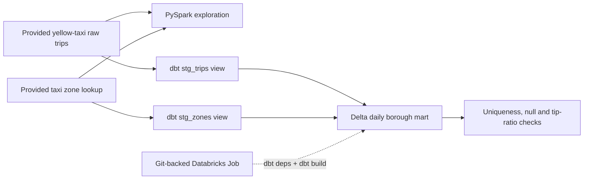

# NYC Taxi Databricks Lakehouse

A Databricks lab exploring yellow-taxi data with PySpark, building a daily borough mart with dbt and Delta Lake, and running dbt from a Git-backed Databricks Job.

**Questions:** Which pickup borough has the most records? How does the average total charge vary by payment type? How can a daily analytics table be updated with an incremental `MERGE`?

My completed HackYourFuture Data Track Week 13 work, with the original notebook, transformation logic and job evidence preserved. [Project provenance](docs/provenance.md) · [Original assignment guide](docs/hyf-assignment.md).

## Data flow



**Stack:** Databricks · PySpark · SQL · dbt · Delta Lake · Databricks Jobs

## Explore the completed work

| Component | What to inspect |
|---|---|
| [PySpark notebook](task-1/pyspark_exploration.ipynb) | Zone join, borough counts, payment-type averages and saved aggregate outputs |
| [dbt project](task-2/) | Two staging views, the incremental daily mart, safe-division macro and data checks |
| [Incremental design](task-2/WRITEUP.md) | Merge key, date boundary, recorded timings and Delta history |
| [Job scheduling](task-3/SCHEDULING.md) | Git source, successful historical run, paused trigger and Jobs/Airflow comparison |

The notebook and dbt source definitions read `hyf.nyc_yellow.raw_trips` and `hyf.nyc_yellow.raw_zones`. Those normalized raw tables are provided by the course workspace; this repository does not ingest public TLC files or provision those tables. Their actual current coverage must be checked in the workspace.

### Saved notebook results

| Question | Recorded result |
|---|---|
| Highest pickup-borough count after the zone join | Manhattan: 112,028,489 records |
| Average `total_amount`, payment type 1 | $30.00 |
| Average `total_amount`, payment type 2 | $23.75 |

These are outputs saved in the original coursework notebook, not a new run or current city-wide statistics. Notebook queries use the raw population; the dbt mart applies staging filters, so their totals are not directly comparable.

### Historical job evidence


The screenshot records a successful manual run on **30 July 2026**, including one incremental model, three passing data tests and one warning-level tip-ratio test. It is historical evidence, not a live deployment status. [Configuration, Git source and paused schedule screenshots](task-3/SCHEDULING.md).

## Model grain and incremental behavior

The model retains the assignment name **`fct_trips`**, but its grain is **one pickup borough per pickup date**. Its Delta merge key is `(pickup_borough, pickup_date)`; it is not a trip-level table. Keeping the name preserves the existing job command and coursework evidence.

It produces `trip_count`, `total_fare`, `avg_tip_pct` and `avg_trip_distance`. Staging excludes missing pickup IDs and negative/NULL fares; an inner zone join excludes unmatched pickup IDs. [Metric definitions and quality limits](docs/metrics.md).

The incremental filter selects dates strictly newer than the maximum date already in the target. This demonstrates an append-only daily load: late records, changes to prior days and additional records on the latest loaded day are skipped. A full refresh reprocesses them. [Current behavior and a future lookback design](task-2/WRITEUP.md).

## Setup and review

Requirements for a warehouse run: a Databricks workspace, SQL warehouse, access to the two normalized source tables, and permission to create views/tables in your own target schema. Python 3.12 and [uv](https://docs.astral.sh/uv/) install the existing locked local dbt environment.

From the repository root:

```sh
cd task-2
uv sync --frozen --python 3.12
```

Follow the [setup guide](docs/setup.md) to create an ignored local profile, set connection variables and build the upstream staging views plus the mart. An offline `dbt parse` review is also available without a Databricks account. Parsing validates project structure; it does not execute SQL or reproduce cloud results.

## Validation and scope

Existing HYF checks are static coursework checks. The portfolio workflow additionally installs the lockfile and parses the dbt project with dummy connection settings. Neither CI path runs Databricks compute.

The original implementation is a learning project: source loading, late-data correction, production alerting and credential management are outside its scope. The job trigger was paused in the saved screenshot. The recorded full/incremental timings are a single historical pair, not a performance benchmark. [Validation scope](docs/validation.md).

## Credits

Author: [Mohammed Alfakih](https://github.com/mohammedalfakih-dev). Built through the [HackYourFuture](https://www.hackyourfuture.net/) Data Track using its [Week 13 assignment scaffold](https://github.com/HackYourAssignment/c55-data-week-13). Taxi data is supplied through the course's Databricks tables; public NYC taxi datasets are published by the [NYC Taxi & Limousine Commission](https://www.nyc.gov/site/tlc/about/tlc-trip-record-data.page).
