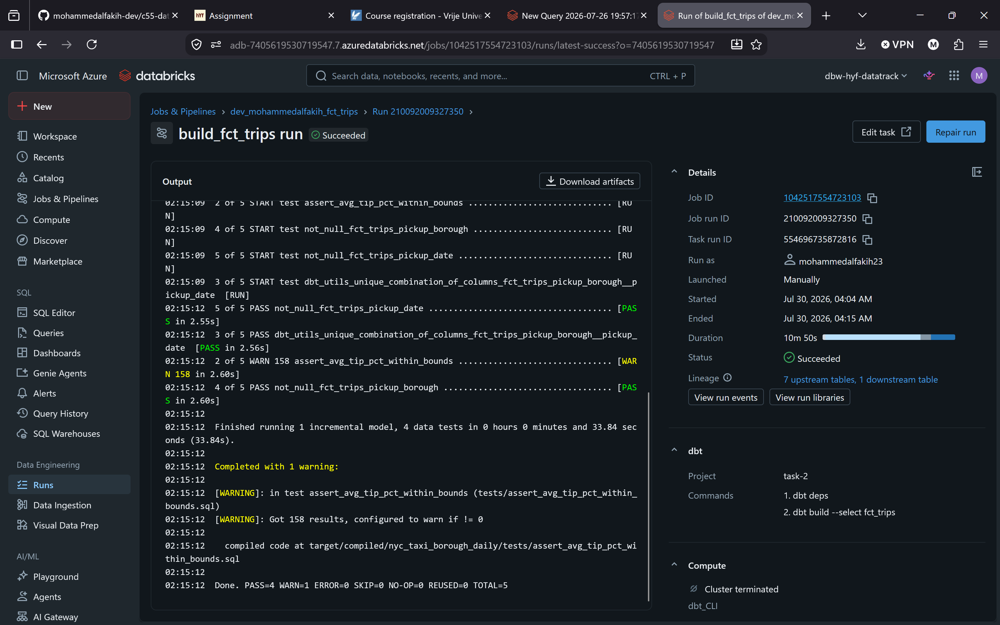
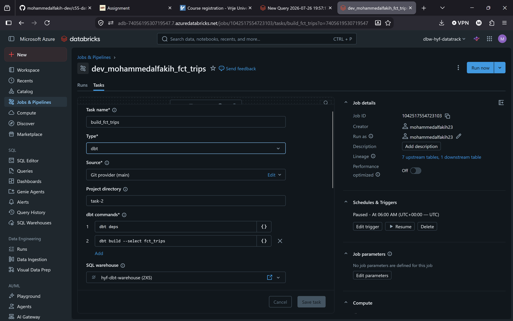
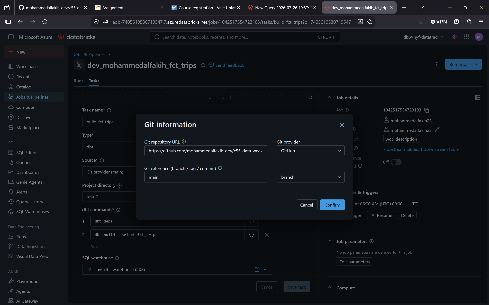
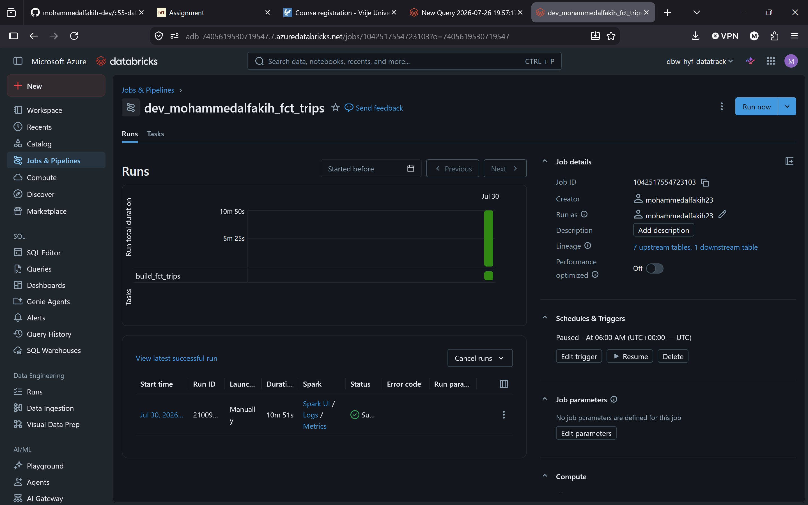

# Git-backed Job scheduling evidence

The coursework Job `dev_mohammedalfakih_fct_trips` ran a dbt task from the personal GitHub fork's `main` branch, project directory `task-2`, using `hyf-dbt-warehouse`. Its commands were `dbt deps` followed by `dbt build --select fct_trips`.

## Historical successful run

The saved screenshot records a **manual run on 30 July 2026**, with Job Run ID `210092009327350`. Its output ends with `PASS=4 WARN=1 ERROR=0`: one incremental model and three tests passed; the tip-ratio test returned 158 warning rows. A successful Job therefore does not imply that every data-quality check was clean.

[Recorded run permalink](https://adb-7405619530719547.7.azuredatabricks.net/jobs/1042517554723103/runs/210092009327350?o=7405619530719547) requires access to the original class workspace. It is not a public portfolio demo; screenshots are available below.

## Configuration and Git source

The original screenshot uses the repository's assignment name. After the planned rename, future runs should use the new Git URL. For a fresh target schema, build upstream models too with `dbt build --select +fct_trips`.

## Paused trigger

The saved schedule is daily at **06:00 UTC**, with the trigger set to **Paused**. This describes the screenshot, not a newly verified live schedule state.

## Databricks Jobs versus Airflow

I would use Databricks Jobs when a pipeline mainly runs dbt, SQL or notebooks in Databricks because scheduling and monitoring stay in the same platform. I would use Apache Airflow when a workflow coordinates multiple systems or needs more complex dependencies across tools.
